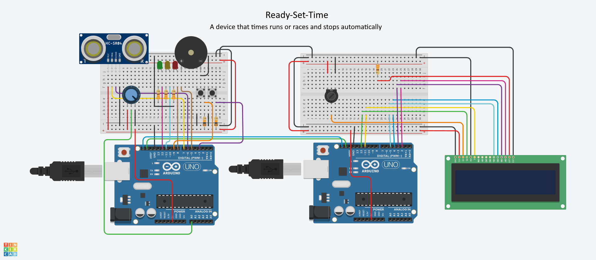

<h2>Embeded Systems (Ready-Set-Time)</h2>

I used two Arduinos communicating through I2C to develop a motion-activated timer. Lights/speakers on the device would alert the user when the timer starts/stops.

<h3>Pinout/diagram:</h3>

