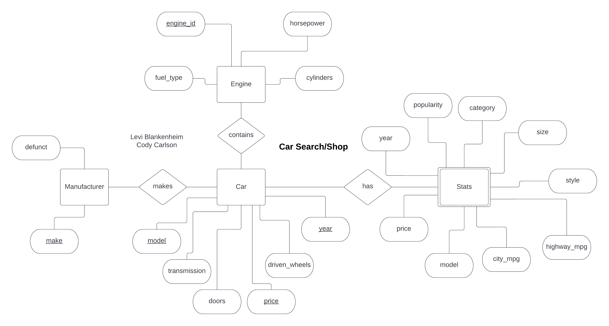

With the help of a partner, we created a database in MySQL for use in Java-based software where users can choose between available cars and add/remove/update their shopping cart. Users can also preview an image of each vehicle (Bing Image Search API). Functionality also includes comparing cars inside their cart.

Database Schema:

